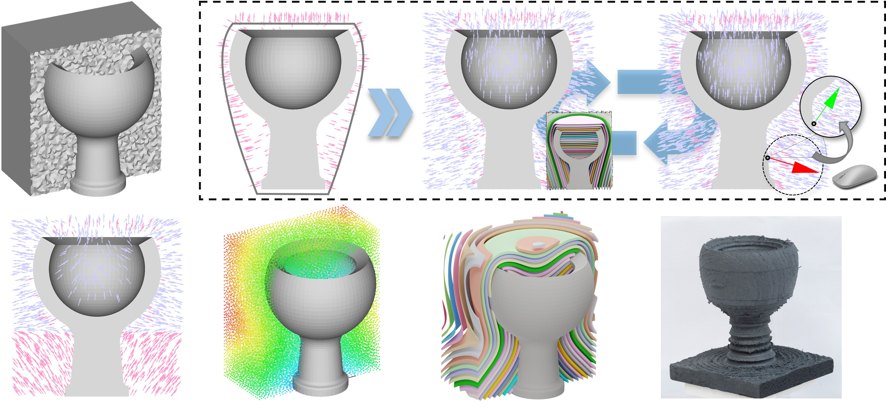

# Vector Field Based Volume Peeling for Multi-Axis Machining

## Abstract
This paper presents an easy-to-control volume peeling method for multi-axis machining based on the computation taken on vector fields. The current scalar field based methods are not flexible and the vector-field based methods do not guarantee the satisfaction of the constraints in the final results. We first conduct an optimization formulation to compute an initial vector field that is well aligned with those anchor vectors specified by users according to different manufacturing requirements. The vector field is further optimized to be an irrotational field so that it can be completely realized by a scalar field's gradients. Iso-surfaces of the scalar field will be employed as the layers of working surfaces for multi-axis volume peeling in the rough machining. Algorithms are also developed to remove and process singularities of the fields. Our method has been tested on a variety of models and verified by physical experimental machining. \

[Read the paper here!](https://arxiv.org/pdf/2308.00472.pdf)

## Installation
Please compile the code with QMake file “ShapeLab.pro”.

Platform: Windows + Visual Studio + QT-plugin (tested version: VS2019 + QT5.12.3 + msvc2017_64)

Installation Steps:
- Install Visual Studio Extension plug-in (QT VS Tool) to open the *.pro file and generate the project
- Set 'ShapeLab' as the start up project
- Enable OpenMP to get best performace at: ShapeLab Property Pages -> Configuration Properties -> C/C++ -> Language -> Open MP Support -> Select 'Yes (/openmp)'
- Open Console at: ShapeLab Property Pages -> Configuration Properties -> Linker -> System -> SubSystem -> Select 'Console (/SUBSYSTEM:CONSOLE)'
- Install Intel oneAPI Math Kernel Library (oneMKL download) and enable it at: ShapeLab Property Pages -> Configuration Properties -> Intel Libraries for oneAPI -> Intel oneAPI Math Kernel Library (oneMKL) -> Use oneMKL -> Select 'Parallel'
- And change the code generation method at: ShapeLab & QMeshLab & GLKLib Property Pages -> Configuration Properties -> C/C++ -> Code Generation -> Runtime Library -> Select 'Multi-threaded(/MT) for release configuration'. Note that this option will be 'Multi-threaded Debug (/MTd) for debug configuration.

## Contact Information
Neelotpal Dutta ([neelotpal.dutta@manchester.ac.uk](mailto:neelotpal.dutta@manchester.ac.uk))\
Charlie C.L. Wang ([changling.wang@manchester.ac.uk](mailto:changling.wang@manchester.ac.uk))

## Usage
### Files Required:
  - The .obj file of the model to be machined . Naming convention to be used: **\<name\>_modelSurf.obj**
  - The .obj file for the convex hull of the model. Naming convention to be used: **\<name\>_convexHull.obj**
  - .TET file of the removable volume (stock - model). This can generated by a boolean opearation on surface meshes followed by tetrahedralization using [TetGen](https://wias-berlin.de/software/index.jsp?id=TetGen&lang=1). Naming convention to be used: **\<name\>_materialSpace.tet**

  The location of all of the above files is to be in the folder **DataSet/TET_MODEL**

### Usage Steps
`Read Data` -> `Initialise Meshes` -> `Initialise Vector Field` -> `Propagate Field` -> `Generate Scalar Field` -> `IsoLayer Generation` -> `ToolPath Generation`

### Read Data
To perform the peeling for the model *\<name\>*, type in the name in the 'File' text box and click on the button `Read Data`.

### Initialise Meshes
Once all the files are read, click the button `Initialise Meshes`. This labels all mesh elements and records the necessary attributes for further processing.

### Initialise Vector Field
The next step requires us to initialise a vector field inside each tetrahedal element. It can be done by clicking the button `Initialse Vector Field`. This function comes with a few pre-defined options to define the vector field anchors. Select the desired checkboxes- Inner Boundary, Outer Boundary
or Convex Hull to initialise the anchors on selected surface. This needs to be done before clicking the `Initialise Vector Field` button. To define custom anchor vectors, go ahead with initialising the vector field without selecting any of the checkboxes.

### Assigning Anchor Through Vertices
Once the vector field has been initialised, the custom anchors can be assigned. One way to do this is by selecting a vertex of the tetrahedral mesh of the <name>_materialSpace. To do that, first, hide the model (shown as \<name\>_modelSurface) and convex hull (shown as \<name\>_targetrSurface) in the treeView Space (see lower right) by un-checking the corresponding boxes. Now, head to the 'Visualization' tab, which allows us to look inside the mesh and select nodes there. Use the 'slide bar' to change the depth of the section and click on 'Update Section'. On the tool-bar, click on the 'Node' icon to display the vertices.  Now, go to the 'Interact' tab and on the tool-bar, select the 'Handle Rigid' icon (last icon). Now, bring the cursor over the vertex that needs to be selected, and **Right Click** on it to select the vertex as anchor. On  the tool-bar, click the 'Profile' icon to display the corresponding anchor vector (note that it is not defined at this point). To define the anchor, click on the `Edit Vector Direction` button and **Left Click** somewhere on the viewport. Now, move the cursor around to change the vector orientation in the current plane. To assign a direction, **Right Click** on the mouse. To see the assigned vector, click on the `Update` button. The (nx,ny,nz) components are displayed on the corresponding boxes. Alternatively, enter the vector components throught the boxes itself and click `Set` (Note that the vector will be normalized). To remove the anchor point, click on `deSelect Node`. To confirm the anchor point and the vector direction, click the `Translate Vector to Tets.` button. Note that the current version does not include an option to remove the anchor point after the confirmation. Following the same steps, assign other anchors, if required.

### Assigning Anchor Through Faces
 ...Instructions to be added soon...

### Propagate Vector Field
This step involves solving equation 11 in the paper to generate the vector field in the whole domain (removable volume). Before clicking on the button `Propagate Field`, enter the magnitude (exponent) for the weight assigned to anchors (Represented as Beta in the paper).

### Generate Scalar Field
After the vector field is solved, click on the button `Generate Scalar Field` to solve the Poisson eqution. Display the nodes to see the colours assigned according to the value of the corresponding scalar field.

### Iso-Layer Generation
Click on the `Iso-Layer Generation` button to get the layers
 
